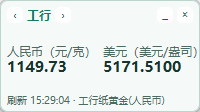

# Gold Reminder Tauri 悬浮窗

## 功能

- 悬浮窗展示双价格：`人民币(元/克)` 和 `美元(美元/盎司)`
- 左右箭头切换银行（工行/建行/中行/农行）
- 每 `5s` 拉取一次最新行情（单接口一次拉取全部银行）
- 缩小按钮隐藏到托盘
- 托盘菜单支持“显示窗口/退出”
- 托盘左键双击恢复窗口

## 数据源

- 接口：`https://api.jijinhao.com/quoteCenter/realTime.htm`
- 解析字段：`q63`
- 可通过环境变量覆盖：
  - `JIJINHAO_API_URL`
  - `JIJINHAO_REFERER`

## 开发运行

```bash
npm install
npm run tauri dev
```

## 构建

```bash
npm run tauri build -- --bundles nsis
```

构建产物：

- 便携可执行：`src-tauri/target/release/tauri-widget.exe`
- 安装包：`src-tauri/target/release/bundle/nsis/GoldReminderWidgetTauri_0.1.0_x64-setup.exe`

## 界面预览



## 资产文件

`asset` 目录已包含可执行文件：

- `GoldReminderWidgetTauri-win-x64.exe`
